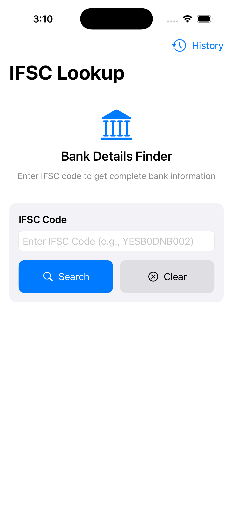

# Razorpay App - Swift/SwiftUI

A modern iOS app built with SwiftUI that allows users to search for bank details using IFSC codes. The app follows the MVVM architecture pattern, demonstrates clean code practices, and includes persistent search history functionality.

## 🚀 Images

<table>
  <tr>
    <td></td>
    <td></td>
    <td></td>
    <td></td>
  </tr>
  <tr>
    <td></td>
    <td></td>
    <td></td>
  </tr>
</table>

## 🚀 Features

### Core Features
- **IFSC Code Lookup**: Enter any valid IFSC code to get comprehensive bank details
- **Real-time Validation**: Input validation for IFSC code format (11 characters, proper structure)
- **Comprehensive Bank Information**: Displays all available data from the API
- **Service Indicators**: Shows which banking services (UPI, RTGS, NEFT, IMPS) are available
- **Error Handling**: Proper error messages and loading states
- **Responsive Design**: Clean, modern UI that works across all iOS devices

### Advanced Features
- **Search History**: Persistent storage of previous searches with UserDefaults
- **Navigation Stack**: Modern SwiftUI navigation with NavigationStack
- **History Management**: Add, remove, and clear search history
- **Quick Access**: One-tap access to previously searched bank details
- **Duplicate Prevention**: Automatically moves repeated searches to top
- **Date Tracking**: Shows when each search was performed
- **Storage Optimization**: Limits history to last 50 searches

### User Experience
- **Loading States**: Progress indicators during API calls
- **Empty States**: Helpful messages when no data is available
- **Swipe Actions**: Swipe to delete individual history items
- **Sheet Presentation**: Modal history view with proper dismissal
- **Visual Feedback**: Smooth transitions and animations
- **Accessibility**: Proper labels and semantic elements


### 🎯 Architecture Components

#### Models
- **`BankDetails`**: Codable struct representing complete bank information from API
- **`APIResponse`**: Response wrapper for API calls (currently unused as API returns direct data)
- **`SearchHistoryItem`**: Individual search history entry with metadata
- **`SearchHistoryManager`**: ObservableObject managing persistent search history

#### Views
- **`ContentView`**: Main search interface with NavigationStack
- **`BankDetailsView`**: Comprehensive display of all bank information
- **`SearchHistoryView`**: History management with list and delete functionality
- **Reusable Components**:
  - `SectionHeader`: Consistent section headers with icons
  - `DetailCard`: Information cards with color coding
  - `InfoRow`: Key-value pair display component
  - `ServiceCard`: Banking service availability indicator
  - `HistoryRowView`: Individual history item display

#### ViewModels
- **`BankDetailsViewModel`**: 
  - Handles all business logic and API communication
  - Manages search state (loading, error, success)
  - Integrates with SearchHistoryManager
  - Provides data binding for views

#### Services
- **`BankServiceProtocol`**: Protocol defining bank data fetching interface
- **`BankService`**: Concrete implementation using URLSession and Combine
- **`NetworkError`**: Custom error types for network operations

## 📚 Libraries and Frameworks

### Native iOS Frameworks
- **SwiftUI**: Modern declarative UI framework
  - NavigationStack for navigation management
  - @StateObject and @ObservedObject for state management
  - Sheet presentation for modal views
  - List with swipe actions for history management

- **Combine**: Reactive programming framework
  - Publisher/Subscriber pattern for API calls
  - AnyPublisher for type erasure
  - Sink for handling async responses
  - Cancellables for memory management

- **Foundation**: Core functionality
  - URLSession for networking
  - JSONDecoder for API response parsing
  - UserDefaults for persistent storage
  - DateFormatter for date display

### No External Dependencies
The app uses only native iOS frameworks, ensuring:
- Minimal app size
- No dependency management complexity
- Full compatibility with iOS ecosystem
- Enhanced security and stability

## 🔧 Technical Implementation

### API Integration
- **Endpoint**: `https://ifsc.razorpay.com/{ifsc_code}`
- **Method**: GET request with URLSession
- **Response**: Direct JSON object (not wrapped in response envelope)
- **Error Handling**: Network errors, invalid codes, parsing failures

### Data Persistence
- **Storage**: UserDefaults for search history
- **Format**: JSON encoding/decoding of SearchHistoryItem array
- **Management**: Automatic cleanup (50 item limit) and duplicate handling

### Input Validation
- **Format Check**: 11-character IFSC code validation
- **Pattern Matching**: Regular expression for proper IFSC structure
- **Real-time Feedback**: Immediate validation on input

### State Management
- **Reactive Updates**: Combine publishers for automatic UI updates
- **Loading States**: Progress indicators during network calls
- **Error States**: User-friendly error messages
- **Success States**: Comprehensive data display

## 🎨 UI/UX Design

### Design Principles
- **Apple Design Guidelines**: Follows Human Interface Guidelines
- **Accessibility First**: Proper labels, semantic elements, and contrast
- **Responsive Layout**: Adaptive design for all screen sizes
- **Visual Hierarchy**: Clear information organization
- **Consistent Styling**: Unified color scheme and typography

### Color Scheme
- **Primary**: Blue for main actions and highlights
- **Success**: Green for available services
- **Error**: Red for errors and unavailable services
- **Secondary**: Gray for supporting information
- **Background**: System colors for proper dark/light mode support

### Typography
- **Headlines**: Bold, prominent titles
- **Body Text**: Readable, properly sized content
- **Captions**: Subtle labels and metadata
- **Monospace**: IFSC codes and technical identifiers

## 🔄 User Flow

### Primary Flow
1. **Launch**: App opens to main search screen
2. **Input**: User enters IFSC code with real-time validation
3. **Search**: Tap search button or press return
4. **Loading**: Progress indicator during API call
5. **Results**: Preview card with basic information
6. **Details**: Tap preview to see comprehensive information
7. **History**: Automatic saving to search history

### History Flow
1. **Access**: Tap "History" button in toolbar
2. **Browse**: View list of previous searches
3. **Select**: Tap any history item
4. **View**: Navigate to detailed bank information
5. **Manage**: Swipe to delete or clear all history

## 📱 Sample IFSC Codes for Testing

- `SBIN0000001` - State Bank of India, Kolkata Main
- `HDFC0000001` - HDFC Bank, Mumbai
- `ICIC0000001` - ICICI Bank, Mumbai
- `AXIS0000001` - Axis Bank, Mumbai
- `YESB0DNB002` - Delhi Nagrik Sehkari Bank (from API example)

## 🛠️ Setup Instructions

### Prerequisites
- **Xcode 16.4+**: Latest version recommended
- **iOS 16.0+**: Minimum deployment target
- **Swift 5+**: Language version

### Installation Steps

1. **Create New Xcode Project**:
   ```
   - Open Xcode
   - Create new iOS project
   - Choose SwiftUI interface
   - Set minimum deployment target to iOS 16.0+
   ```

2. **Add Project Files**:
   ```
   - Create folder structure as shown above
   - Copy each file content to corresponding Swift files
   - Ensure proper import statements
   ```

3. **Configure Project**:
   ```
   - Set bundle identifier
   - Configure app icons and launch screen
   - Add network permissions if needed
   ```

4. **Build and Run**:
   ```
   - Select target device or simulator
   - Build and run the project (⌘+R)
   - Test with sample IFSC codes
   ```

## 🔍 Code Quality Features

### Best Practices Implemented
1. **MVVM Architecture**: Clear separation of concerns
2. **Protocol-Oriented Programming**: Testable service layer
3. **Reactive Programming**: Combine for state management
4. **Error Handling**: Comprehensive error states and user feedback
5. **Input Validation**: Client-side validation for better UX
6. **Memory Management**: Proper use of weak references and cancellables
7. **Code Organization**: Logical file structure and naming conventions
8. **Documentation**: Comprehensive comments and README

### Performance Optimizations
- **Lazy Loading**: Efficient list rendering for history
- **Memory Management**: Automatic cleanup of network requests
- **Storage Efficiency**: Limited history size and JSON compression
- **UI Responsiveness**: Main thread updates and background processing

### Technical Improvements
- **Core Data**: Replace UserDefaults with Core Data for complex queries
- **Widget Support**: Home screen widget for quick searches
- **Siri Shortcuts**: Voice commands for common searches
- **Dark Mode**: Enhanced dark mode support
- **Localization**: Multi-language support
- **Unit Tests**: Comprehensive test coverage
- **UI Tests**: Automated UI testing

## 📊 API Data Structure

The app handles all fields from the Razorpay IFSC API:

```json
{
  "BRANCH": "Branch name",
  "CENTRE": "Banking centre",
  "DISTRICT": "District name",
  "STATE": "State name",
  "ADDRESS": "Complete address",
  "CONTACT": "Phone number",
  "IMPS": true/false,
  "CITY": "City name",
  "UPI": true/false,
  "MICR": "MICR code",
  "RTGS": true/false,
  "NEFT": true/false,
  "SWIFT": "SWIFT code",
  "ISO3166": "ISO country code",
  "BANK": "Bank name",
  "BANKCODE": "Bank code",
  "IFSC": "IFSC code"
}
```

## 🤝 Contributing

This project demonstrates modern iOS development practices and can serve as a reference for:
- SwiftUI best practices
- MVVM architecture implementation
- Combine framework usage
- Network layer design
- Persistent data storage
- Navigation patterns

Feel free to use this code as a learning resource or starting point for similar applications.

---

**Built with ❤️ using SwiftUI and modern iOS development practices**
